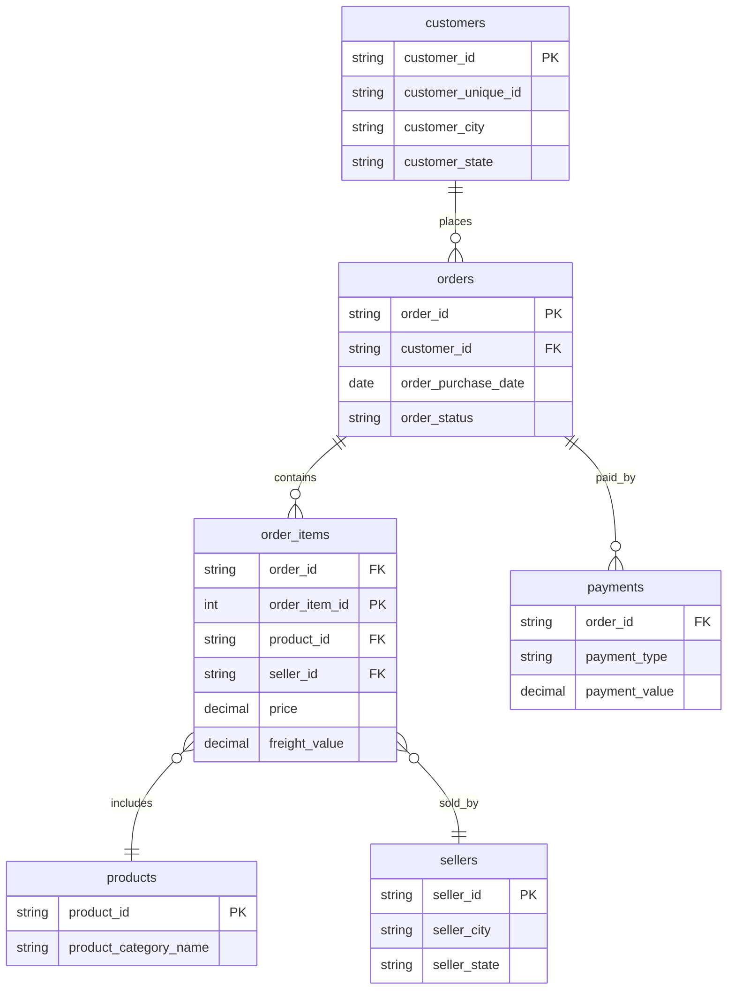
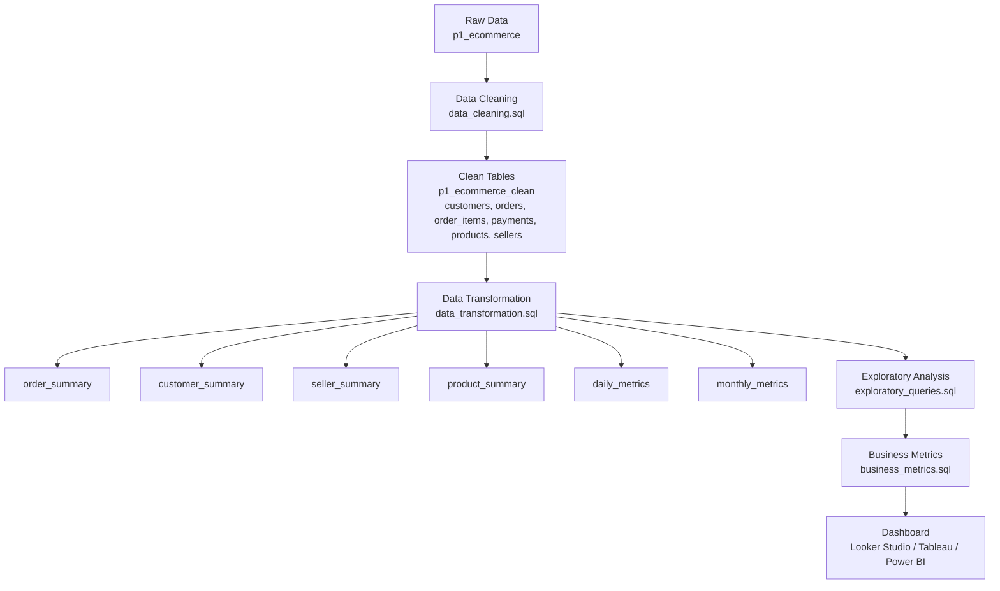

# 📦 E‑Commerce Analytics (Brazilian Olist Dataset)


A complete end‑to‑end data analytics project built using MySQL, covering data cleaning, transformation, exploratory analysis, and business metrics generation. This project demonstrates analytical thinking, SQL engineering skills, and dashboard‑ready data modeling.

---

## 📌 Project Overview
This project analyzes the Brazilian Olist e‑commerce dataset to uncover insights about customer behavior, seller performance, product trends, delivery efficiency, and overall business health.

The workflow follows a structured analytics engineering approach:

1. **Data Cleaning** – Standardize raw tables, validate dates, trim text fields, and ensure schema consistency.  
2. **Data Transformation** – Build analytical summary tables for customers, sellers, products, and orders.  
3. **Exploratory Analysis** – Perform EDA to understand patterns and validate data quality.  
4. **Business Metrics** – Generate KPIs for dashboards and executive reporting.  

---

## ⭐ Key Insights
- 65% of orders come from the Southeast region of Brazil.  
- Electronics and furniture categories generate the highest revenue.  
- Average delivery delay is **12.4 days**, with the worst delays in northern states.  
- 80% of sellers are concentrated in only 3 states.  
- Freight cost shows a moderate correlation with order value.  

---

## 🗂️ Repository Structure

```
📦 e-commerce-analytics-olist-brazil
│
├── 📁 sql
│   ├── data_cleaning.sql
│   ├── data_transformation.sql
│   ├── exploratory_queries.sql
│   └── business_metrics.sql
│
├── 📁 diagrams
│   ├── erd.png
│   └── pipeline_flowchart.png
│
├── README.md
└── LICENSE (optional)
```

---

## 🧹 1. Data Cleaning  
**File:** `sql/data_cleaning.sql`

Tasks performed:
- Trim all text fields  
- Standardize date formats using regex validation  
- Convert timestamps to DATE  
- Validate numeric fields  
- Create clean schema: `p1_ecommerce_clean`  

Cleaned tables:
- customers  
- orders  
- order_items  
- payments  
- products  
- sellers  

---

## 🔄 2. Data Transformation  
**File:** `sql/data_transformation.sql`

Creates analytical summary tables:
- `order_summary`  
- `customer_summary`  
- `seller_summary`  
- `product_summary`  
- `daily_metrics`  
- `monthly_metrics`  

These tables are optimized for dashboards and business KPIs.

---

## 🔍 3. Exploratory Data Analysis (EDA)  
**File:** `sql/exploratory_queries.sql`

Includes:
- Order status distribution  
- Delivery performance  
- Product category insights  
- Seller concentration  
- Customer geography  
- Payment behavior  

---

## 📊 4. Business Metrics  
**File:** `sql/business_metrics.sql`

Key KPIs:
- Total revenue  
- Total orders  
- Customer lifetime value  
- Seller performance  
- Product category revenue  
- Monthly & daily trends  
- Freight vs revenue analysis  

---

## 🧬 Entity Relationship Diagram (ERD)



---

## 🔁 Data Pipeline Flowchart



---

## ▶️ How to Run This Project

1. Import the raw Olist dataset into MySQL.  
2. Run `data_cleaning.sql` to generate the cleaned schema.  
3. Run `data_transformation.sql` to build analytical tables.  
4. Use `exploratory_queries.sql` for EDA.  
5. Use `business_metrics.sql` to generate KPIs.  
6. (Optional) Connect the summary tables to a dashboard tool.  

---

## 📊 Dashboard (Optional)
If you build a dashboard, add the link here:

```
🔗 Dashboard Link: (coming soon)
```

---

## 🛠️ Tech Stack
- **MySQL 8**  
- **SQL Analytics Engineering**  
- **Data Modeling**  
- **Dashboard Tools (Looker Studio / Tableau / Power BI)**  

---

## 👤 Author
**Ahmad Iqbal Maulana**  
Aspiring Data Analyst | SQL • Dashboarding • Data Modeling  

---

## 📄 License
This project is open‑source under the MIT License.
